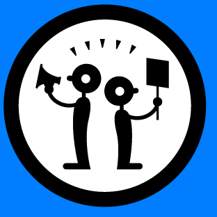
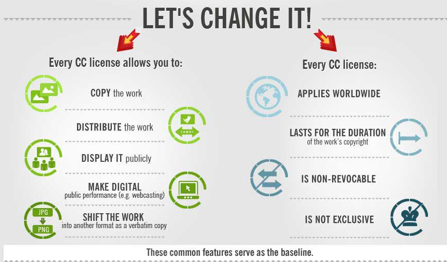

# Module 4 Assignment
 
This work by <a xmlns:cc="http://creativecommons.org/ns#" href="https://github.com/WhatLibrarian/Presentations/blob/master/ccweek2.md" property="cc:attributionName" rel="cc:attributionURL">Roe McKernan, MLIS</a> is licensed under a <a rel="license" href="http://creativecommons.org/licenses/by/4.0/">Creative Commons Attribution 4.0 International License</a>.
___

# Using Creative Commons Licenses
## Institutional Challenges
### a remix

___

# Frequent Challenges

In this assignment I would like to thoughtfully address some of the institutional challenges I have wrestled with as both the OER librarian and the chief copyright resource for faculty, staff and administration.
___

## Audience

This challenge is not about any particular issue, but about how to speak to the different type of audiences on your campus.

This short video by COMMpadres Media includes topics such as the importance and types of audience analysis, and methods for gathering information for audience analysis.

[<figure>](https://www.youtube-nocookie.com/embed/Hfue7l-WuJ4?rel=0)
  <figcaption><a href ="https://creativecommons.org/licenses/by/3.0/">Creative Commons Attribution License 3.0</a></figcaption>
</figure>

There are many resources available to increase your skills as a communicator. If you are the sole campus resource for Open Educational Resources and the Creative Commons licenses they rely on, please be thoughfull of your audiences' need and the value proposition Creative Commons represents to your institution.

---

## Misconceptions & the Need to KNOW

This challenge is a frequent and repeated issue surrounding legal and ethical use of third-party materials.  Faculty will want to know how much they can use and if their use is "OK".  

Compounding this is that there is a lot of scary language around copyright including some harsh penalties. It can feel sometimes like a campaign of FUD.

The following graphic is a visual depiction of the confusion surrounding how faculty may feel about interacting with copyright.

<figure><figcaption>"Copyright, contracts, confusion" by Giulia Forsythe, via Flickr. November 26, 2012.  [CC0 1.0](https://creativecommons.org/publicdomain/zero/1.0/) Universal Public Domain Dedication.</figcaption></figure>
  
**Enthusiastically shout the good news!**  

*Above image from the [Electronic Frontier Foundation](https://www.eff.org/files/banner_library/EFF-work-icons.PNG).   [Creative Commons Attribution License 3.0](http://creativecommons.org/licenses/by/3.0/us/)*

That the **Creative Commons** license allows at its most basic level the ability to make and distribute copies.  It's important to remember to not get lost in the FUD that can arise amidst the legal and technical language and that sometimes the simplest message is to trust that with any Creative Commons license you can 'use' the resource.  The basic act of copying (which technology allows very easily) is the foundation of the licenses.

Sharing is Caring.

The following derivative of a [larger infographic](https://i.amz.mshcdn.com/G2VmSDN0Zbcf8JHQQyxgAs9f_P0=/2012%2F12%2F08%2Fdd%2FCCinfograph.jIz.jpg) (found via footer.com) can be a good resource for a poster or a presentation slide.
 [Creative Commons Attribution-ShareAlike](https://creativecommons.org/licenses/by-sa/3.0/us/)

---

## Scholarly Communication & Contracts
### (P.S. Work for Hire)

A corollary to the inquiry 'what can I use' is encouraging faculty to share the work they have created. This is where the rubber is going to hit the road at your institution.  Its going to be very important to read and assess the contract that governs faculty work where you are located.

1. Grant Contracts
2. Faculty Contracts
3. Federal and/or state 'Work for Hire' laws such as [17 U.S.C. § 101](https://www.copyright.gov/circs/circ30.pdf) that governs works created during employment.

#### Things to be mindful of

- You can negotiate your publishing contracts.
  - [Sample Addendum](https://library.osu.edu/blogs/copyright/2016/11/14/negotiate/) from the universities of the Big 10 Academic Alliance. This addendum works to preserve rights that faculty authors commonly wish to keep.
- A great resource before you choose a journal to publish in is "[Think. Check. Submit.](https://thinkchecksubmit.org/)". It is also a great resource to share with your faculty.
- [Shareable brochure on author rights](https://sparcopen.org/our-work/author-rights/brochure-html/) from Sparc
- You faculty contract is negotiated periodically. Find out when yours is next.  Get involved.
- Fantastic resource for faculty new to scholarly communication in general is from [Berkeley](http://www.lib.berkeley.edu/scholarly-communication/publishing/copyright/managing-copyrights)

CC BY 4.0 Plamena Popova via [Communia Association](https://www.communia-association.org/).

___
 2018 | Roe McKernan | [Creative Commons Certification Assignment 4](https://github.com/WhatLibrarian/Presentations/blob/master/CertificateCC/Mod4/ccmod4.md)
